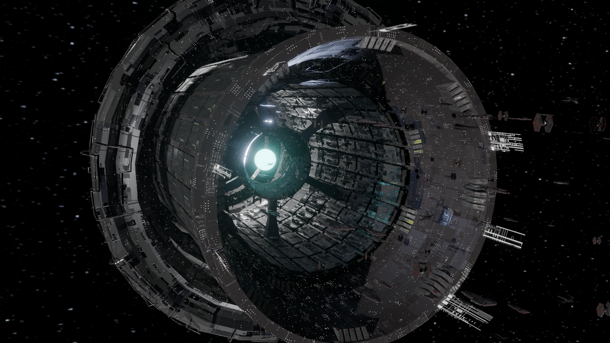

<h1 align="center">Overmind 3D Portfolio</h1>

<p align="center">
  <em>An interactive 3D portfolio set aboard a massive spaceship, home to two robotic eye-creatures — the Overmind and the Sentinel.</em>
</p>

<p align="center">
  <a href="https://dev-moulin.github.io/my-portfolio/"></a>
</p>

<p align="center">
  
  
  
  
  
  
</p>

<p align="center">
  <a href="https://dev-moulin.github.io/my-portfolio/">
    
  </a>
</p>

<p align="center"><b>English</b> · <a href="#français">Français</a></p>

---

## Overview

A single-page 3D experience that replaces the classic scrolling portfolio with a real-time
scene. Aboard a massive spaceship drifting through the void, two robotic **eye-creatures** —
the **Overmind** and the **Sentinel** (inspired by the sentinels of *The Matrix*) — move through
space alongside a few mini-ships. Navigation, project cards,
and storytelling all happen inside this 3D world — driven by scroll/swipe, an on-canvas nav arc,
and a guided tutorial.

Everything is rendered with **Three.js** and orchestrated by a fleet of **XState** state
machines (one per subsystem: camera, bloom, lighting, materials, timeline, onboarding…). The app
is a **pnpm monorepo** and ships automatically to **GitHub Pages**.

## Highlights

- **Living scene** — the Sentinel creature drifts through space with baked GLB animations
  blended by native crossfades; the Overmind reacts, glows, and presents objects on a loop.
- **In-world navigation** — an on-canvas *NavArc* + scroll (desktop) / swipe (mobile)
  camera timeline, with a skippable intro trip.
- **Procedural starfield** — a device-adaptive, bloom-safe star vault (angular sizing,
  anti-flicker, per-device density).
- **Interactive onboarding** — a named-step tutorial (9 steps desktop / 8 mobile) with
  free-look, gyroscope look, and guided card reading.
- **Holographic project cards** — bilingual (FR/EN) content on shader-driven screens,
  clickable 3D links, and a downloadable CV.
- **Mobile-first care** — quality profiles, orientation gate, gyroscope look, touch
  navigation, HTTPS dev for secure-context testing.
- **Post-processing** — Unreal bloom, CRT page transitions, KTX2 + Draco-compressed assets.

## Tech Stack

| Area | Tech |
|------|------|
| **3D / rendering** | Three.js 0.178, GLSL shaders, UnrealBloomPass, Draco + KTX2 compression |
| **State** | XState (one machine per subsystem) |
| **UI shell** | React 19, Vite 7, TypeScript 5.9 |
| **Tooling** | pnpm 10 workspaces, gltf-transform, GitHub Actions → Pages |

## Architecture

A pnpm monorepo split into an app shell and a self-contained 3D engine:

```
my-portfolio/
├─ apps/
│  └─ web/               # Vite + React shell: overlays, i18n, layout, dev telemetry
└─ packages/
   ├─ overmind-3d/       # the 3D engine (framework-agnostic core)
   │  ├─ scene/          # SceneRenderer, animation loop, camera, starfield, cards…
   │  ├─ machines/       # XState machines (timeline, bloom, lighting, scene…)
   │  ├─ sentinelCreature/  # the Sentinel creature: wander, crossfades, free-look
   │  └─ components/     # React overlays (onboarding, dev panels…)
   └─ shared/            # shared types & utilities
```

Each **scene system** follows the same lifecycle — `constructor → update(delta) → dispose()` —
and is wired into `SceneRenderer` with minimal coupling. Cross-cutting communication uses
custom DOM events (`overmind:*`) so subsystems stay decoupled from the God Object.

## Getting Started

> Requires **Node 20+** and **pnpm 10+**.

```bash
pnpm install          # install all workspaces
pnpm dev              # dev server → http://localhost:5173
pnpm build            # production build → apps/web/dist
pnpm preview          # serve the production build
pnpm type-check       # typecheck every package
```

Mobile testing needs a secure context (iOS refuses gyroscope/DeviceOrientation over HTTP):

```bash
pnpm --filter web dev:https   # HTTPS dev server for real-device testing
```

---

<a name="français"></a>

## Français

### Aperçu

Une expérience 3D en page unique qui remplace le portfolio défilant classique par une scène
temps réel. À bord d'un immense vaisseau qui dérive dans le vide, deux **créatures** robotiques
— l'**Overmind** et la **Sentinel** (inspirées des sentinelles de *Matrix*) — évoluent dans
l'espace, entourées de quelques mini-vaisseaux. La
navigation, les cartes projets et l'histoire se déroulent **dans ce monde 3D** — pilotées par le
scroll/swipe, un arc de navigation sur le canvas et un tutoriel guidé.

Tout est rendu avec **Three.js** et orchestré par une flotte de machines à états **XState**
(une par sous-système : caméra, bloom, lumières, matériaux, timeline, onboarding…). Le projet
est un **monorepo pnpm** déployé automatiquement sur **GitHub Pages**.

### Points forts

- **Scène vivante** — la Sentinel dérive dans l'espace via des animations GLB bakées mélangées
  par crossfades natifs ; l'Overmind réagit, brille et présente des objets en boucle.
- **Navigation intégrée** — un *NavArc* sur le canvas + une timeline caméra scroll (desktop)
  / swipe (mobile), avec un trajet d'intro skippable.
- **Champ d'étoiles procédural** — une voûte adaptative à l'appareil et compatible bloom
  (taille angulaire, anti-clignotement, densité par appareil).
- **Onboarding interactif** — un tutoriel à étapes nommées (9 desktop / 8 mobile) avec
  free-look, regard gyroscopique et lecture de carte guidée.
- **Cartes projets holographiques** — contenu bilingue (FR/EN) sur des écrans shader, liens
  3D cliquables et CV téléchargeable.
- **Soin du mobile** — profils de qualité, porte d'orientation, regard gyroscopique,
  navigation tactile, dev HTTPS pour tester en contexte sécurisé.
- **Post-traitement** — bloom Unreal, transitions de page CRT, assets compressés KTX2 + Draco.

### Démarrage

> Nécessite **Node 20+** et **pnpm 10+**. Voir la section *Getting Started* ci-dessus pour les
> commandes (`pnpm install`, `pnpm dev`, `pnpm build`, `pnpm --filter web dev:https`).

---

<p align="center">
  <sub>Built by <a href="https://github.com/Dev-Moulin">Paul Moulin</a> ·
  <a href="https://dev-moulin.github.io/my-portfolio/">Live Demo</a></sub>
</p>
